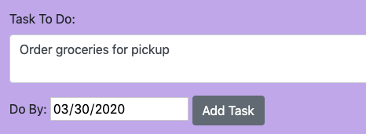
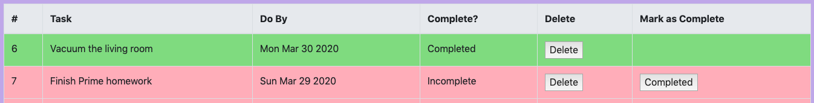

# Weekend To Do List Project

*Duration: 10 hours*

## Description

This app allows the user to create a to-do list of tasks and add a due date to complete the task. User can also delete tasks as desired, or mark the task as completed.

## Screen shots

## Prerequisites
- Postgres
- Postico

## Installation
1. Create a database named `weekend_to_do_app`,
2. The queries in `weekend_to_do_app.sql` contain the table and data needed to run the app properly. As a reminder, you will want to have **Postgres** installed. Postico is also strongly recommended to install to run these queries.
3. Open your code editor and run an `npm install` in your terminal,
4. Run `npm start` in your terminal.

## Usage
1. To add a new task to the list, enter a task in the input under `Task To Do`. Add a due date below under `Do By`. Note: Date should be entered as MM/DD/YYYY. Click `Add Task` to add to the list.
2. If you want to mark a task as complete, click `Completed` at the end of the row. This will turn your task from red to green to denote that it is done.
3. If you want to delete a task from the list, click `Delete` near the end of the row.

## Built With
- SQL
- Javascript
- jQuery
- Bootstrap

## Acknowledgement
Thank you to Mary Mosman and Tom Coffee for giving me the knowledge to create this application.

## Support
For suggestions or issues, please contact me at aescott87@gmail.com.
